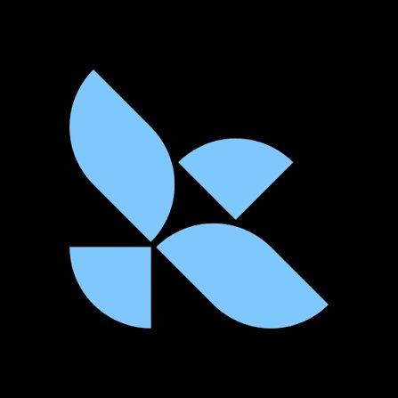
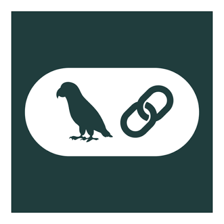
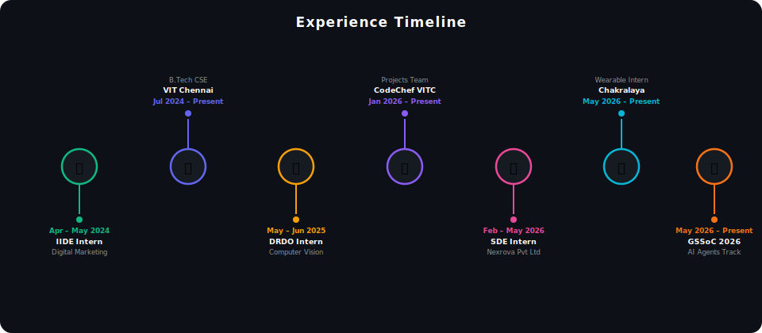

<div align="center">


<br/>

<a href="https://www.linkedin.com/in/divya-priya38/"></a>
<a href="https://github.com/divyapriya382006"></a>
<a href="https://divya-priya-portfolio-website.vercel.app"></a>
<a href="mailto:divyapriya382006@gmail.com"></a>
<a href="https://leetcode.com/u/DivyaPriya382006/"></a>
<a href="https://www.kaggle.com/divyapriya455"></a>
<a href="https://www.codechef.com/users/pride_bird_56"></a>

</div>

---

## What I'm Building

- Building a **Secure GenAI System** for Automated Cyber Threat Intelligence — LangChain + LangGraph RAG pipeline with role-based access and prompt security
- Developing **wearable & embedded system applications** at Chakralaya Analytics — real-time IoT data, BLE, device connectivity
- Contributing to open-source AI agent projects under **GirlScript Summer of Code 2026**
- Exploring **Flutter, React, and edge AI** for real-world deployments

---

## Tech Stack

<div align="center">
  

<br/>


&nbsp;&nbsp;

</div>

---

## Experience Timeline

<div align="center">
  
</div>

---

## Projects

<div align="center">
<table border="1">
<tr>
<th>🔧 In Progress</th>
<th>🚀 Shipped</th>
<th>🧠 Research & ML</th>
</tr>
<tr>
<td valign="top" width="33%">

**Nexus Crisis App**<br/>
  <br/>
Emergency comms via BLE mesh, no internet. RAG AI assistant + survivor heatmap.

<hr/>

**Helio Sync**<br/>
  <br/>
Solar design platform. Auto edge detection. Ranked **7th / 50+** at Devshouse'26.

<hr/>

**Secure GenAI CTI**<br/>
 <br/>
Threat intelligence reports with prompt security & role-based access.

</td>
<td valign="top" width="33%">

**EventPulse** 🥇<br/>
  <br/>
Full-stack event platform — **1st place**, 7-hr hackathon. Payments, live chat, OD tracker.

<hr/>

**PortfolioPal**<br/>
  <br/>
Code-free portfolio maker with visitor keys & dark mode. [Live →](https://portfolio-pal-1.onrender.com/)

<hr/>

**ML Toolkit**<br/>
  <br/>
Solo 8-hr hackathon — 60+ ML & EDA functionalities, no-code interface.

</td>
<td valign="top" width="33%">

**Sonar Classification**<br/>
 <br/>
ANN binary classifier — ~98% train, ~83% test accuracy.

<hr/>

**Heart Disease Prediction**<br/>
 <br/>
ANN on patient health data — ~88% accuracy with full eval metrics.

<hr/>

**Song Recommendation API**<br/>
 <br/>
Content-based recommender using TF-IDF cosine similarity on song metadata.

</td>
</tr>
</table>
</div>

---

## GitHub Signals


---

## Competitive Coding

### LeetCode


---

### Kaggle


<br/><br/>


</div>

---

### CodeChef


<br/><br/>


<br/>


</div>

---

## Achievements

<div align="center">

| Award | Event | Project |
|-------|-------|---------|
| 🥇 1st Place | Reforge Hackathon, OSPC VIT Chennai | EventPulse |
| 🏆 Track Winner | Dev Hub Hackathon, Fateh Educational Consultancy | Healthcare App |
| 🎖️ 7th / 50+ Teams | Devshouse'26, Google Developers Club VITC | Helio Sync |

</div>

---

## Current Direction

<div align="center">

```text
Full Stack  ──►  AI Systems  ──►  Intelligent Applications
```

**Target roles:** AI/ML Engineer &nbsp;·&nbsp; Full Stack Developer &nbsp;·&nbsp; AI Systems Builder

<br/>


</div>
