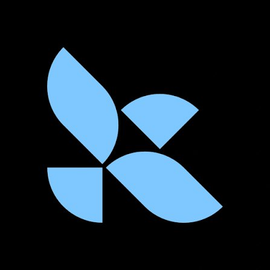
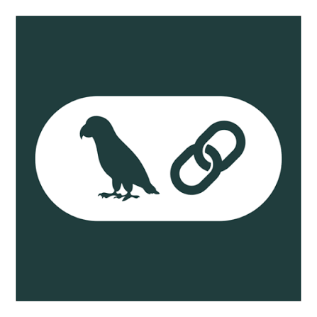
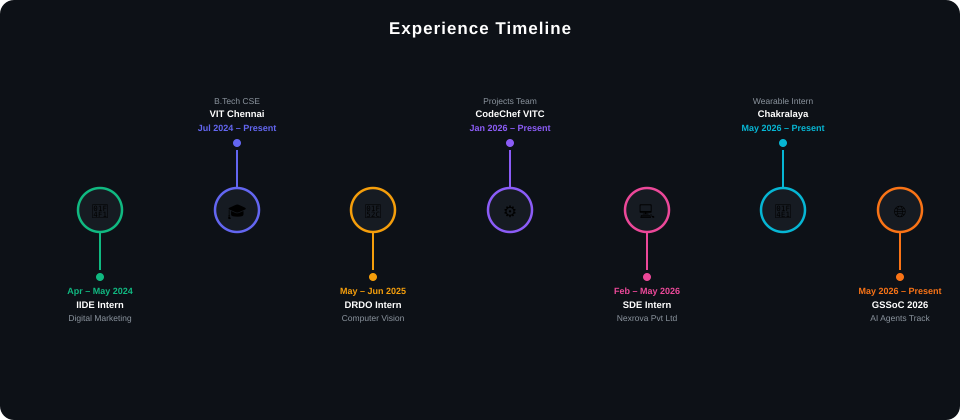

```text
%%*::::::-=%%%%%%%%%%%%%%%%%%##%=.:::::####%%%:::::...... ......       divya@priya ~ 
%%#::::::--%%%%%%%%%%%%%%%%%%##%+.:::::*%##%%%-.::::..... .......  .   ──────────────────────────────────
%%%-:::::--%%%%%%%%%%%%%%%%%%##%*.::::.+%##%%%=.:::::.... ..........   OS: ............... GitHubOS 2026
%%%=:::::--#%%%%%%%%%%%%%%%%%%%%#:::::.=%##%#%=.:::::.... ..........   Host: .............. VIT Chennai
%%@+:::::::*@%%%%%%%#######*****+:.....-%##%#%+.:::::.... ..........   Role: ............... Software Developer | AI Engineer
%%@*.:::::--=--:::--::..:::-----:.. ...:%#%%%%*.:::::....  .........   Kernel: ............ Full-Stack AI Core
%%@#:::::::......::..........-==*=::::.:#%%%%%#:::::.....  .........   IDE: ................ VSCode 1.96.0
%%%%-::........:--:::::.......::.::::::.#%#%%%%:::::.....  .........   
%%%@-.........:--:.::......::.:-.....::.#@%@@@@-::.......  .    ....   Internships: ....... Chakralaya Analytics, Nexrova, DRDO
%@*-..........:........::-==-:::........=+=--::     .....      .....   Scholarships: ....... SheFi '17 Scholar
%=............ .:--==+=+****+=:..........---==+-.......... .   .....   Open Source: ........ GSSoC '26 Contributor
:..............:=+++++********+-.  ......*@%@@@+.::::..... .   .....   
::....  .....:-=+=++++**+****+++-.   .   .*%%%%+.::::..... .    ....   Languages.Code: .... Python, C, C++, Java
:..... .....:-+++**************++=-.      :%%%@#.::::..... .........   Languages.Web: ..... HTML, CSS, Flutter
..... ......-+++*****#*************=.      =%%%#.::::.....  .  .....   Languages.Real: .... English, Tamil, Hindi, French
.:.  .. ...:::.::-=++**+===---==++++=:     .#%%%:::::.....        ..   
:.. .. ...:=+=-::.:-+++=----++=++===++.     -%%%-.:::.....        ..   Contact: ............ divyapriya382006@gmail.com
..... .. .....-::::=*#+=-...  :-:-=++*=     .*%%-.:::.....       . .   LinkedIn: divya-priya38 · GitHub: divyapriya382006
 ... .:......:-====+##*++=-:::--=+*****. .:  -%%=.::......       ...
.....--=+*++++**++++##******+***#####**-:-== .#%+.:.......         .   
....:-+*######+=+***####*++*########**+-=---  =@+.:........            
 ...:=*+****+==-=-:-=+==++=-=+******+++---:   .#*.::.......            
 . .:===-==-=+*=...:::---+#*=:-=++++++=--=     -#::........            
   .:=----:-+===-:::::-==+++++::===++==+*-     .+:.........            
    :====+++=---=++==++++===+++++++++===-      ..:.........            
    .-=====+**++=-==+++++*****+==+++-  :        ..:........            
      :----=++++++=++++******+=====:   +-        ..........            
       .::---=+***######***+===-:.    :=-=        ......::.            
     .    .:::--=====+++++=---:.      :+==         .::..:+++=.         
            ....::::----------:.       .:           .:.:::=--*+-:.     
            ......::::---==--:.                     ....:---=*%##*+-   
             ..:.:::::------::.         .            ....:.::=##**##   
              .::::::::----::..                       ..::::.-=**++*   
*#*:.          .:::::::---::..                         .:::..---==--   
@@@%-::.        ...:::::::....                         . .:..::-===-   
%%%@+::::.:.    ....:::::.....                        ........-====:   
@@%%*:-:::=%=.  ...:::::::::....                      ....:.::--=---   
```

<div align="center">


<br/>

<a href="https://www.linkedin.com/in/divya-priya38/"></a>
<a href="https://github.com/divyapriya382006"></a>
<a href="https://divya-priya-portfolio-website.vercel.app"></a>
<a href="mailto:divyapriya382006@gmail.com"></a>
<a href="https://leetcode.com/u/DivyaPriya382006/"></a>
<a href="https://www.kaggle.com/divyapriya455"></a>
<a href="https://www.codechef.com/users/pride_bird_56"></a>

</div>

---

## What I'm Building

- **Secure GenAI CTI System** — LangChain + LangGraph RAG pipeline for automated cyber threat intelligence, with role-based access and prompt security
- **Wearable & embedded systems** at Chakralaya Analytics — real-time IoT data, BLE, device connectivity
- Open-source contributor, **GirlScript Summer of Code 2026** (AI Agents Track)
- Exploring **Flutter, React, and edge AI** for real-world deployment

---

## Tech Stack

<div align="center">
  
  <br/>
  
  &nbsp;&nbsp;
  
</div>

---

## Experience Timeline

<div align="center">
  
</div>

- **Wearable App Development Intern**, Chakralaya Analytics — *ongoing*
- **Projects Department Member**, CodeChef VIT-Chennai Chapter — *ongoing*
- **Open Source & Research Department Member**, Open Source Programming Club VITC — *ongoing*
- **Social Media Lead**, CITTAA Student Chapter VITC — *ongoing*
- **SheFi '17 Scholar** — *ongoing*
- Ex–SDE & AI Engineering Intern, Nexrova Technologies
- Ex–Computer Vision Intern, DRDO (CVRDE)

---

## Projects

<div align="center">
<table border="1">
<tr>
<th>🔧 In Progress</th>
<th>🚀 Shipped</th>
<th>🧠 Research & ML</th>
</tr>
<tr>
<td valign="top" width="33%">

**CivicFlow**<br/>
  <br/>
Verifiable agentic automation for citizen services, with cryptographic tamper-evident logging.

<hr/>

**Nexus Crisis App**<br/>
  <br/>
Emergency comms via BLE mesh, no internet. RAG assistant + survivor heatmap.

<hr/>

**Secure GenAI CTI**<br/>
 <br/>
Threat intel reports with prompt security & role-based access.

</td>
<td valign="top" width="33%">

**EventPulse** 🥇<br/>
  <br/>
Full-stack event platform — **1st place**, 7-hr hackathon. Payments, live chat, OD tracker.

<hr/>

**Helio Sync**<br/>
  <br/>
Solar design platform with auto edge detection. **Top 10 / 3500+ registrations** at Devshouse'26.

<hr/>

**PortfolioPal**<br/>
  <br/>
Code-free portfolio maker with visitor keys & dark mode. [Live →](https://portfolio-pal-1.onrender.com/)

</td>
<td valign="top" width="33%">

**Sonar Classification**<br/>
 <br/>
ANN binary classifier — ~98% train, ~83% test accuracy.

<hr/>

**Heart Disease Prediction**<br/>
 <br/>
ANN on patient health data — ~88% accuracy, full eval metrics.

<hr/>

**ML Toolkit**<br/>
 <br/>
Solo 8-hr hackathon — 60+ ML & EDA functions, no-code interface.

</td>
</tr>
</table>
</div>

---

## GitHub Signals

<p align="center">
  
</p>
<p align="center">
  
</p>

<div align="center">15 followers · 13 following · 585 contributions in the last year</div>

---

## Competitive Coding

<div align="center">

**LeetCode** — 295/4055 solved · 200 Easy / 92 Med / 3 Hard · 125 active days · 52-day max streak
<br/>


**Kaggle** — 19 public notebooks · 19 upvotes · 48 forks
<br/>


**CodeChef** — Rating 1092 (Div 4, 1★) · DSA Rating 1547 · 258+ problems solved · 13 contests
<br/>


</div>

---

## Achievements

| Award | Event | Project |
|-------|-------|---------|
| 🥇 1st Place | Reforge Hackathon, OSPC VIT Chennai | EventPulse |
| 🏆 Track Winner | Dev Hub Hackathon, Fateh Educational Consultancy | VitalSense |
| 🏛️ Hackathon Winner | Innovative 5.0 Hackathon, Bionary Club VITC | CivicFlow |
| 🎖️ Top 10 / 3500+ regs | Devshouse'26, Google Developers Club VITC | Helio Sync |


---

## Certifications

- **CockroachDB** — Cockroach Labs

---

<div align="center">

```text
Full Stack  ──►  AI Systems  ──►  Intelligent Applications
```

**Target roles:** AI/ML Engineer · Full Stack Developer · AI Systems Builder

<br/>


</div>
